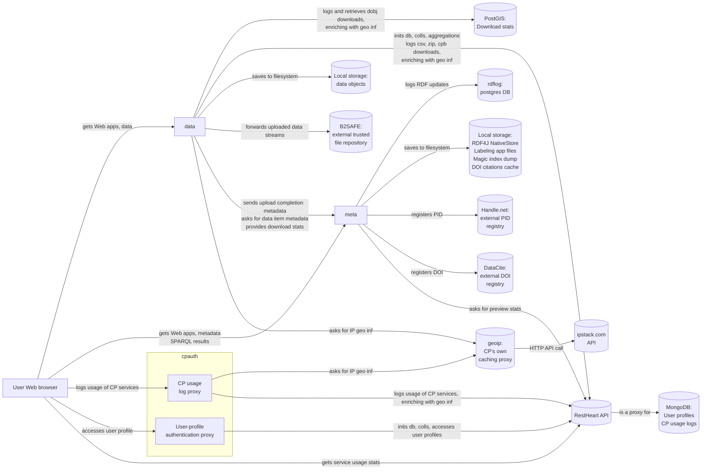

# Deployment and development tools for ICOS Carbon Portal services

Deployment and provisioning of CP services is automated using Ansible.
All related configurations and definitions are found in `devops` folder of this repository.

Some of CP's own, in-house-developed, services, are built, packaged and
deployed using SBT build tool. Source code of CP-specific SBT plugins can be
found in folder `sbt`.

# Communications diagram for the core CP services


# Getting started

## Install required utilities
To get started, one needs:
- Ubuntu 20.04 LTS or an equivalent Linux distribution (e.g. Linux Mint 20)
- Git
- Docker
- docker-compose
- pip
- Ansible

To install all of the above except ansible, run:

`$ sudo apt install git docker.io docker-compose python3-pip`

To install the latest version of ansible, first run:

`$ pip3 install --user ansible==q`

This will result in an error message - since there is no version named `q`;
however, the error message will include the available versions. Choose the
highest version which is a proper release (e.g `5.5.0` is a proper release, but
`5.0.0a1` is an alpha, `5.0.0b2` is a beta, and `5.0.0rc1` is a release
candidate.)

`$ pip3 install --user ansible==5.5.0`

Make sure `ansible-playbook` is on your path. Get the ansible-vault password
from a colleague and place it in file `~/.vault_password`.


## Install java and scala

To develop/build/deploy Scala-based services, install Java with

`$ sudo apt install openjdk-21-jdk`

and SBT by following the instructions on https://www.scala-sbt.org/

To be able to publish JAR artefacts to CP's Nexus repo, get the `.credentials`
file from a colleague and place it into `~/.ivy2/` folder.


## Setup ssh

We have several servers, each running several virtual machine containers (using
[LXD](https://linuxcontainers.org/lxd/)). When deploying software and restoring
backups we will access these servers using ssh. Your personal ssh key will have
been installed on the servers.

**IMPORTANT** - it's your personal responsibility to protect your private ssh
key, at a minimum it should be password protected.

Check that you can access our primary production server by running this
command:

`$ ssh -p 60022 root@fsicos2.lunarc.lu.se hostname`

The output should be:

`fsicos2.lunarc.lu.se`

If you want to save some on typing, you can create a ssh config file. Add the
following to `~/.ssh/config`:
```
host fsicos2
    hostname fsicos2.lunarc.lu.se
    user root
    port 60022
```

Now you can re-run the same command in a simpler way:

`$ ssh fsicos2 hostname`

The results should be the same. The rest of this document will use the simpler
syntax (i.e `ssh fsicos2` instead of `ssh -p 60022 root@fsicos2.lunarc.lu.se`)


## rdflog
The `rdflog` service is just a postgres database. It is a dependency of the
`meta` service. To setup a development environment for `meta` you first have to
setup `rdflog`.

The easiest way is to retrieve a copy of the production database and run it in
a docker container. In order to retrieve a copy of the production database
you'll need root access to the fsicos2 server, the following instructions
depends on it.

### Automatic setup and backup recovery with Ansible:
You can use the development inventory together with `core.yml` and `core_restore.yml` playbooks to setup rdflog with Ansible.

1. Make sure Ansible is installed (see [Install required utilities](#install-required-utilities))

2. Add your chosen `rdflog_db_pass` password to the `passwords.yml` file in your development inventory, as described in [README](devops/dev.inventory/group_vars/core_host/README.md)

3. Create the rdflog container:

    `cd infrastructure/devops`

    `ansible-playbook -i dev.inventory -t rdflog core.yml`

4. Recover rdflog backup from BorgBackup on fsicos2:

    `ansible-playbook -i dev.inventory -t rdflog core_restore.yml`

### Manual setup

Please note that the following commands - even though fairly detailed - are
meant more as a guide than a precise step-by-step manual. The important thing
to understand is that we're dumping a postgresql database and then we're
restoring it again. Currently the source database is in docker, but it doesn't
have to be; currently it's on another host (requiring ssh), but it doesn't have
to be.

#### Verify that postgres replication is working
This step is important to perform regularly until we have a status dashboard where any problems with RDF log replication would become immediately apparent. RDF log is our solution to persistence of all data/document objects' and collections' metadata, and as such, very important.

`$ ssh fsicos2`

`root@fsicos2:~# cd /docker/rdflog`

`root@fsicos2:/docker/rdflog# ./ctl status`

The output should be:
```
                          slot_report
---------------------------------------------------------------
 The following slots are currently replicating => cdb, fsicos3
```
After a while the report will also produce a table with the latest timestamps in each of the RDF log tables.

#### Retrieve database
`$ ssh fsicos2 'cd /docker/rdflog && docker-compose exec -T db pg_dump -Cc --if-exists -d rdflog | gzip -c' > /tmp/rdflog_dump.gz`

This command will ssh to fsicos2, then change to the rdflog directory (in order
to access docker-compose.yml) and execute `pg_dump` within the running rdflog
database container. The `pg_dump` command makes sure to include `create
database` commands. The default output of `pg_dump` is a text format which we
pipe through gzip in order to cut down on transfer time. The result is a
compressed sql file which is stored as /tmp/rdflog_dump.gz on the local host.


#### Start postgres container for rdflog
`$ docker run -d --name rdflog -ePOSTGRES_PASSWORD=p -p 127.0.0.1:5433:5432 postgres:15`

This will create a docker container or localhost. It requires that you've setup
docker on your machine and that you have enough privileges to run docker.

The docker container will:
* have the container name `rdflog`
* be running in the background
* be available on port 5433 on localhost. note that 5433 is chosen as not to
  conflict with postgres' default port of 5432 which might be in use on
  localhost
* have a user named `postgres` with the password `p`

#### Restore backup into container
`$ zcat /tmp/rdflog_dump.gz | docker exec -i -u postgres rdflog psql -q`

Now we extract the compressed sql file to standard output and pipe it into the
running postgres docker container, where the `psql` command will receive it and
execute it.

It shows error messages like "ERROR:  role "rdflog" does not exist", they can be ignored.


#### Connect to database
(This step is only informative, so it is ok to skip)

If you don't have postgres installed on host:

`$ docker exec -it -u postgres rdflog psql rdflog`

If you do have postgres installed on host:

`$ psql --host localhost --port 5433 -U postgres`

Likewise, if you need to connect to the postgres database using programmatic
means, point your program to localhost:5433 (don't forget the port number which
is not the default one)

#### Grant all on all tables in schema "public" to rdflog

`docker exec -it rdflog bash`

`psql -U postgres`

`\c rdflog`

`\d` to list all the tables

`\dg`  list the roles

`CREATE ROLE rdflog WITH LOGIN ENCRYPTED PASSWORD 'Password matches your meta application.conf'; `

` GRANT ALL ON ALL TABLES IN SCHEMA public TO rdflog;`

` GRANT ALL ON ALL SEQUENCES IN SCHEMA public TO rdflog;`


#### Shutdown and remove container
When the container is not needed any more:
`$ docker rm -f rdflog`

#### Restore rdflog backup on staging
Instructions on how to restore the rdflog database into the staging environment are available in a separate [wiki page](https://github.com/ICOS-Carbon-Portal/infrastructure/wiki/Backup-Recovery)


## restheart
[Restheart](https://restheart.org/) is an open source "Web API" server written
in java. It's needed by our `data` and `cpauth` services. Restheart uses
[MongoDB](https://www.mongodb.com/) for storage.


### Automatic setup and backup recovery with Ansible:
You can use the development inventory together with `core.yml` and `core_restore.yml` playbooks to setup restheart and mongodb with Ansible.

1. Make sure Ansible is installed (see [Install required utilities](#install-required-utilities))

2. Create the restheart and mongodb containers:

    `cd infrastructure/devops`

    `ansible-playbook -i dev.inventory -t restheart_setup core.yml`

3. Recover restheart backup from BorgBackup on fsicos2:

    `ansible-playbook -i dev.inventory -t restheart core_restore.yml`

### Manual setup

We run restheart and mongodb in docker (using a docker-compose.yml file). Once
it's up and running we'll populate mongodb by restoring a database from backup.

### Retrieve files and start restheart/mongodb
First, fetch `docker-compose.yml` and `restheart.yml` files:

```
curl -oL docker-compose.yml https://github.com/ICOS-Carbon-Portal/infrastructure/raw/master/devops/roles/icos.restheart/templates/docker-compose.yml
wget https://github.com/ICOS-Carbon-Portal/infrastructure/raw/master/devops/roles/icos.restheart/templates/restheart.yml
```

Create and start RestHeart and MongoDB containers with:

`$ docker-compose up -d`

Now restheart is up and running and talking to mongodb. Next we'll restore a
backup of the production database and use to populate mongodb.


### Using borgbackup to restore a copy restheart's production database

Many of our services use a backup software called
[BorgBackup](https://www.borgbackup.org/). It's an application written in
python and as such we can install it using python. Use the same procedure as
for ansible to find the latest version and then install it:

`$ sudo apt install libssl-dev`

`$ sudo apt install libacl1-dev`

`$ pip3 install pkgconfig`

`$ pip3 install --user borgbackup==1.2.0`

Each of our services backups to a borg `repository`. A borg repository is can
be thought of as a database contained in a single directory. The borg client
can interact with this repository, even over ssh.

We have two locations (i.e directories on a server) where we store borg
repositories, one on fsicos2 and on cdb. In this example we'll restore from
fsicos2.

First issue a ssh command (which uses the `fsicos2` ssh-alias setup earlier) to
list the available borg repositories:

```
$ ssh fsicos2 ls ~bbserver/repos
callisto_home_ute.repo
cpauth.repo
cpmeta.repo
drupal.repo
jupyter.repo
mailman.repo
nextcloud.repo
nexus.repo
nginx-static.repo
postgis.repo
prometheus.repo
quince.repo
radon_map.repo
restheart.repo
```

Each of these directories are a borgbackup repository. Each `repository`
contains several `archives`. Each time a backup is done, a new archive is
created. We'll now use borgbackup (which you've just installed using pip) to
list all the archives within the restheart repository.

```
$ borg list --short fsicos2:~bbserver/repos/restheart.repo
Warning: Attempting to access a previously unknown unencrypted repository!
Do you want to continue? [yN] y
...
2022-03-22T18:36:10
2022-03-23T00:36:11
2022-03-23T06:36:11
```

I've removed some of the output, keeping only the last three lines. Each line
is the name of an `archive`. The archives are named after the time they're were
created. The last backup in this example was taken on 2022-03-23 at 06:36:11 in
the morning.

Next we'll show which files are present in the latest archive:
```
$ borg list fsicos2:~bbserver/repos/restheart.repo::2022-03-23T06:36:11
drwxr-xr-x root   root          0 Wed, 2022-03-23 06:36:01 backup
-rw-r--r-- root   root   758834973 Wed, 2022-03-23 06:36:10 backup/server.archive
```

It turns out to be a single directory `backup` with a single file
`server.archive`. Let's extract that backup (i.e restore from the borg repo on
fsicos2 to our local directory).
```
$ borg extract fsicos2:~bbserver/repos/restheart.repo::2022-03-23T06:36:11
$ tree
.
└── backup
    └── server.archive

1 directory, 1 file
```

We now have our own local copy of the restheart production database taken this
very morning.

Finally we'll use the freshly restored backup to populate the mongodb database
that we have running in a docker container (which we started in the previous step.)

`$ docker exec -i restheart-mongo mongorestore --archive --drop < backup/server.archive`


## postgis
Used by `data` service to log object downloads and query for download stats.

### Automatic setup and backup recovery with Ansible:
You can use the development inventory together with `core.yml` and `core_restore.yml` playbooks to setup postgis with Ansible.

1. Make sure Ansible is installed (see [Install required utilities](#install-required-utilities))

2. Add your chosen `postgis_admin_pass`, `postgis_reader_pass`, and `postgis_writer_pass` passwords to your `passwords.yml` file in your development inventory, as described in [README](devops/dev.inventory/group_vars/core_host/README.md)


3. Create the postgis container:

    `cd infrastructure/devops`

    `ansible-playbook -i dev.inventory -t postgis_setup core.yml`

4. Recover postgis' backup from BorgBackup on fsicos2:

    `ansible-playbook -i dev.inventory -t postgis core_restore.yml`

### Manual setup

Creating Docker container and installing PostGIS in it:<br>
`docker run -e POSTGRES_PASSWORD=blabla --name postgis -p 127.0.0.1:5438:5432 -d postgres:15.3`

Specify the password in `data` application.conf `cpdata.downloads.admin.password`

`docker exec -ti postgis /bin/bash`

`apt-get update && apt-get install postgresql-15-postgis-3`

Either create a new database or restore a backup


### EITHER Create the database
- Login to postgres inside the container `psql -U postgres`
- Create the two databases `CREATE DATABASE cplog; CREATE DATABASE siteslog;`
- Create two roles `CREATE USER reader WITH PASSWORD 'blabla'; CREATE USER writer WITH PASSWORD 'blabla';`
- Specify the passwords in `data` application.conf `cpdata.downloads.reader.password` and `cpdata.downloads.writer.password`


### OR Recover postgis' backup from BorgBackup on fsicos2
The backup is expected to be an SQL cluster dump of Postgres in a file named `stdin`.<br>
`borg list /disk/data/bbserver/repos/postgis.repo | tail`

Restoring from the cluster dump made with `pg_dumpall`:<br>
`egrep -v '^(CREATE|DROP) ROLE postgres;' ./stdin | docker exec -i postgis psql -v ON_ERROR_STOP=1 -f - -U postgres`

## meta
Deploy rdflog on your development machine. Clone the repository from GitHub. Copy `application.conf` from your old machine, or from your fellow developer. Alternatively, create `application.conf` from scratch, and then look at `meta`'s default `application.conf` in `src/main/resources` to determine what settings need to be overridden. At a minimum, the following is needed:<br>
```
cpmeta{
    rdfLog{
        server.port: 5433
        credentials{
            db: "rdflog"
            user: "rdflog"
            password: "as used with the command above: CREATE ROLE rdflog WITH LOGIN ENCRYPTED PASSWORD '...'"
        }
    }
    citations.eagerWarmUp = false
}
```
When starting `meta` for the first time, if you don't have RDF storage folder preserved from another machine/drive, the service will go into a "fresh init" mode of initialization from RDF logs, with no indices created, neither RDF4J nor CP ones. The service will issue a warning. This mode can also be triggered by a local config:
```
cpmeta.rdfStorage.recreateAtStartup = true
```
You'll need to restart the service after the "fresh init". Initialization may take long time (~1 hour)


# Getting started (front end apps)
## Nodejs and npm
Needed for running the front-end build tools.

Install Node.js according to [NodeSource](https://github.com/nodesource/distributions#debinstall) (choose the latest LTS release, which is v16.x at the time of writing this, but will change in the future). Node.js includes npm.


## Nginx

Install Nginx with `sudo apt install nginx`

Move `/etc/nginx` folder and `/etc/hosts` file from your previous machine, or get needed config files from your fellow developers.


# Useful commands
To get a list of Docker container IDs together with their Linux process IDs (run as root):
`docker ps | awk '{print $1}' | tail -n +2 | xargs docker inspect -f '{{ .Config.Hostname }} {{ .State.Pid }}'`

To purge unused Docker images:
`docker rmi $(docker images --filter "dangling=true" -q --no-trunc)`

To get a list of top 10 processes by memory usage:
`ps aux --sort -rss | head -n 10`

To get process' command:
`ps -fp <pid>`

To see all parents and direct children of a process:
`pstree -p -s <pid>`

Working dir of a process by id:
`pwdx <pid>`


## Restheart
Users that specified ORCID ID in their user profile:

`curl -G --data-urlencode 'keys={"_id":1, "profile.orcid":1}' --data-urlencode 'filter={"profile.orcid":{"$regex": ".+"}}' http://127.0.0.1:8088/db/users?count=true`

Count Finnish cpauth users (only works if the total user count is below 1000):

`curl -G --data-urlencode 'keys={"_id":1}' 'http://127.0.0.1:8088/db/users?pagesize=1000' | jq -r '._embedded[] | [._id] | @tsv' | grep -E "\.fi$" | sort -uf | wc -l`

Get popular variables in time serie previews:

`curl -o page1.json 'https://restheart.icos-cp.eu/db/portaluse/_aggrs/getPopularTimeserieVars?pagesize=10&page=1'`

Transform download counts json from the previous command to tsv (requires jq installed):

`cat page1.json | jq -r '._embedded[] | [.count, .ip, .megabytes] | @tsv' > page1.tsv`

Sort the results by download count descending:

`cat page1.tsv page2.tsv | sort -nr > icos_dl_stats_2018-03-27.tsv`

## Postgis

Example of command line access to the downloads database (on the production server):

`root@fsicos2:~# lxc exec -t postgis -- bash`

`root@postgis:~# su postgres`

`postgres@postgis:/root$ psql -d cplog`

`cplog=# SELECT ip, COUNT(id) AS cnt FROM public.downloads WHERE ts::date > date '2022-12-31' GROUP BY ip ORDER BY cnt DESC LIMIT 20;`
