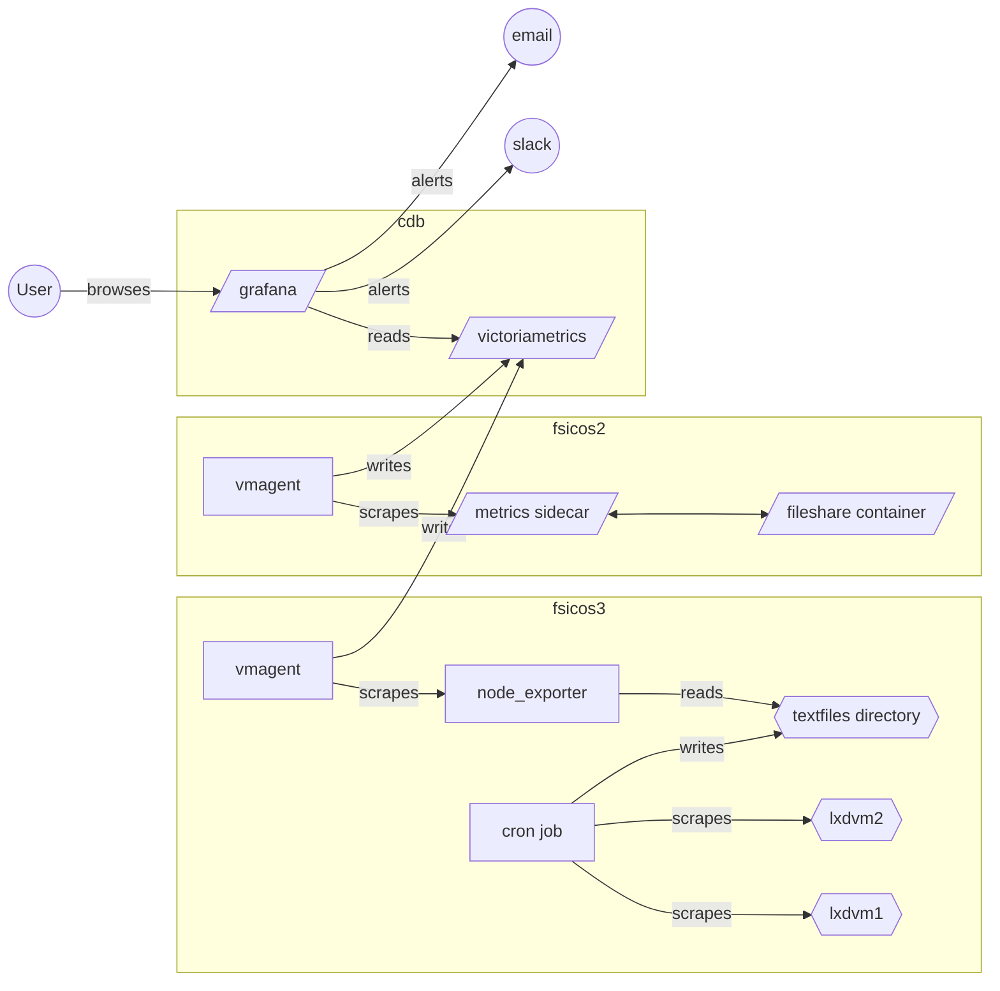

# Monitoring stack
Provision our monitoring stack, which is a Prometheus stack consisting of:

* victoriametrics - drop-in replacement for Prometheus itself. Acts as database
  and remote-write destination for vmagent
* vmagent - one on each host. Scrapes the local targets for metrics and
  remote-writes them to victoriametrics
* grafana - frontend visualizer and alertmanager.

## victoriametrics
Victoriametrics is  started out as a replacement for Prometheus builtin database
(called tsdb). It then grew more features and can now be used as a faster,
leaner and more competent Prometheus replacement.

We have it configured to accept remote-writes from vmagent, acting as a "push"
destination.

It runs as a docker-compose project on cdb.

## vmagent
Part of the Victoriametrics project. We have one running on each host. It's
responsible for scraping targets on the host and then forwarding the metrics to
victoriametrics.

## grafana
Used for visualizations of the metrics. It also has alert capability by way of
a built in alertmanager (from the Prometheus project). It runs in the same
docker-compose stack as the victoriametrics database.

# Flowchart of monitoring stack

