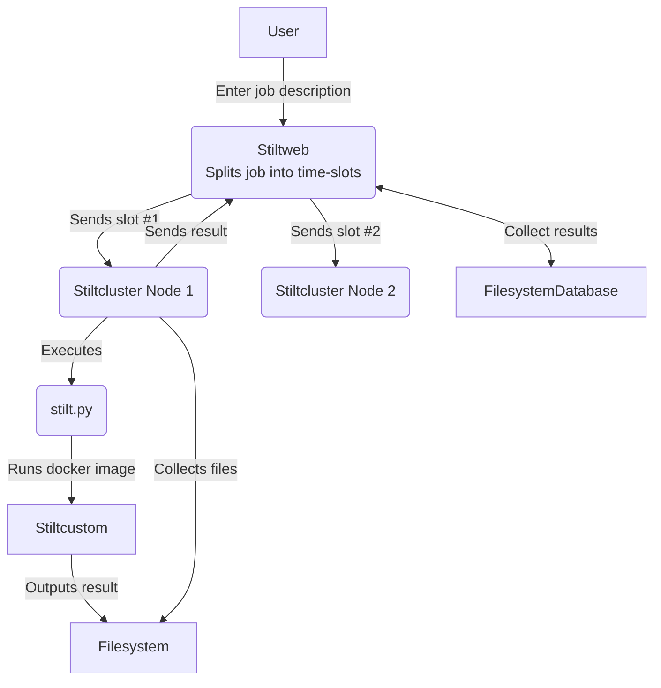

# STILT modeling software

In this directory are script and Dockerfiles to build the STILT software as a
docker image. 

The docker image is then used by our [STILT web service](https://stilt.icos-cp.eu/)

# Understanding the flow of STILT jobs

+ [Stiltweb](https://github.com/ICOS-Carbon-Portal/stiltweb)
+ [Stiltcluster](https://github.com/ICOS-Carbon-Portal/stiltweb/tree/master/stiltcluster/src/main)
+ [stilt.py](https://github.com/ICOS-Carbon-Portal/infrastructure/blob/master/devops/roles/icos.stiltrun/templates/stilt.py)
+ [Stiltcustom](https://github.com/ICOS-Carbon-Portal/infrastructure/blob/master/stilt/base/Dockerfile)

# Building a new STILT docker image for use by [stilt.py](../devops/roles/icos.stiltrun/templates/stilt.py)

To build the docker image you'll need docker installed. Then run:

    $ ./build.sh
    
If everything goes well, the script ends by echoing the commands needed to
export the new docker image to file

    $ docker save stiltcustom | gzip -c > stiltcustom-CHECKSUM.tgz

## Setting the SVN PASSWORD

As part of building the docker images, the source code for stilt is checked
out from a SVN repository. If you have access to the ansible vault then the
user and password should be set automatically (see build.sh for details).

Otherwise you'll have to set the JENSVNUSER and JENASVNPASSWORD variables.

    $ export JENASVNUSER=myuser export JENASVNPASSWORD=secret
    

# Uploading a newly built image to a stiltcluster node

Now we'll upload the newly built image and set the docker tags.

If you haven't already, run the commands echoed by build.sh to save the docker
image.

    $ docker save stiltcustom | gzip -c > stiltcustom-CHECKSUM.tgz
    
Then upload the image to the stiltcluster node on which you aim to test it.

    $ scp stiltcustom-CHECKSUM.tgz fsicos4-stiltcluster:
    
Now ssh to the stiltlcluster node.

    $ ssh fsico4-stiltcluster
    
    
The stiltcluster software uses an image named `stiltcustom` by default. Tag
the current image to make it easy to switch between images.

    $ docker tag stiltcustom stiltcustom-current
    
Now load the newly scp:ed image into docker.

    $ zcat stiltcustom-490dfc22049a.tgz | docker load
    The image stiltcustom:latest already exists, renaming the old one with ID sha256:148fa72c67d756cd6dcd43ec890f2813ef6c868f2b81c2c7dc84156c68a27bb5 to empty string
    Loaded image: stiltcustom:latest
    
You can see how docker has loaded the new stiltcustom image and also
overwritten the `stiltcustom` tag. This means that right now, if any
stiltcluster job comes in, it'll use the new and untested stiltcustom
image. Let's fix that.

    $ docker tag stiltcustom stiltcustom-new
    $ docker tag stiltcustom-current stiltcustom
    
We've saved the newly imported image's tag as stiltcustom-new and restored the
old stiltcustom tag.

# Testing a stiltcustom image

If you've ssh:ed to a stiltcluster node (i.e a host that's been provisioned by
the icos.stiltrun ansible role), you'll have access to the `stilt`
command. By default, the `stilt` command uses the docker image tagged
`stiltcustom` (as do the stiltcluster software) but another image can be
selected using `--image`:

    $ stilt --image=stiltcustom-new HTM 56.10 13.42 150 2012061500 2012061500

